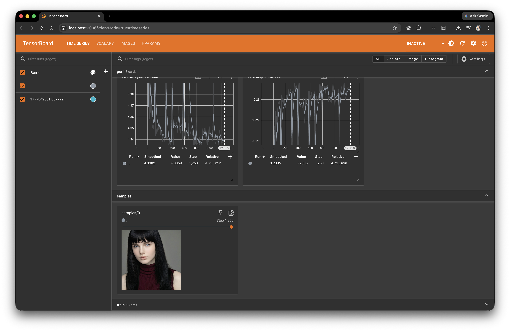
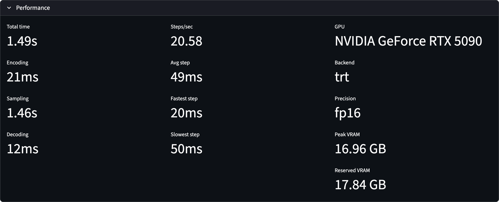

# SDXL LoRA Trainer

Single-purpose, high-UX SDXL LoRA training toolkit with a CLI-first design.

- Clean CLI with familiar ComfyUI-style flags (`--sampler`, `--scheduler`, `--cfg`, etc.)
- Fast feedback: tqdm progress bars, TensorBoard logs, periodic validation samples
- Supports classic LoRA and LyCORIS adapters
- TensorRT-accelerated inference with a Streamlit UI for hot-start generation


*Example: Training a face LoRA on the [ariadne-face](https://github.com/jszaday/ariadne-face) dataset.*

## Installation

```bash
python -m venv venv
source venv/bin/activate  # Windows: venv\Scripts\activate
pip install -e .

# Dev dependencies (tests, linting)
pip install -e ".[dev]"

# TensorRT support (NVIDIA package index)
pip install -e ".[trt]" --extra-index-url https://pypi.nvidia.com
```

## Quick Start

```bash
python -m lora_trainer.cli \
  --checkpoint stabilityai/stable-diffusion-xl-base-1.0 \
  --train_data /path/to/training/images \
  --steps 5000 \
  --batch_size 4 \
  --workspace ./runs/my_experiment
```

## Training

### Required Arguments

| Flag | Description |
|---|---|
| `--checkpoint` | Base SDXL checkpoint path or HuggingFace model ID |
| `--train_data` | Directory of training images (optional `.txt` caption files) |
| `--steps` | Total training steps |
| `--batch_size` | Batch size per GPU |
| `--workspace` | Output directory for checkpoints, logs, and samples |

### Training Data Format

```
/path/to/training/images/
  image1.jpg
  image1.txt   (optional caption)
  image2.png
  ...
```

If a `.txt` file with the same basename exists it is used as the caption; otherwise the caption defaults to empty.

### Validation Sampling

Generate sample images periodically during training:

```bash
python -m lora_trainer.cli \
  --checkpoint base_sdxl.safetensors \
  --train_data /path/to/images \
  --steps 5000 \
  --batch_size 4 \
  --workspace ./runs/experiment \
  --sample_prompts prompts.json \
  --sample_every 500 \
  --scheduler karras \
  --sampler euler_ancestral \
  --cfg 7.0 \
  --sampler_steps 30 \
  --samples_per_prompt 2
```

Structured prompts as JSON/JSONL:

```json
[
  { "prompt": "a mountain landscape", "negative": "low-res", "seed": 1234, "name": "mountain" },
  { "prompt": "a portrait of a person", "negative": "blurry" },
  { "prompt": "a cute cat", "seed": 42 }
]
```

Each entry may include `prompt`/`positive` (required), `negative`, `seed`, and `name`. JSONL (one object per line) is also supported.

Sample images are saved individually:
- With name: `step_000500_mountain.png`
- Without name: `step_000500_0.png`, `step_000500_1.png`, etc.

### All Training Flags

**Optimizer**
- `--learning_rate`: Learning rate (default: 1e-4)
- `--grad_accum`: Gradient accumulation steps (default: 1)
- `--optimizer`: Optimizer spec (default: `adamw`). Supports `adamw`, `lion`, `prodigy` with optional kwargs: `prodigy(lr=1e-4,weight_decay=0)`.
- `--lr_scheduler`: LR scheduler spec, e.g. `constant_with_warmup(warmup_steps=100)`. Names: `constant`, `constant_with_warmup`, `linear`, `cosine`, `cosine_with_restarts`, `polynomial`.

**Data**
- `--image_size`: Training image size (default: 1024)
- `--num_workers`: Data loading workers (default: 4)

**Sampling**
- `--scheduler`: `karras`, `simple`, `normal`, `exponential`, `sgm_uniform` (default: normal)
- `--sampler`: `euler`, `euler_ancestral`, `heun`, `dpmpp_2m`, `dpmpp_2m_sde`, `dpmpp_sde`, `lms`, `pndm`, `ddim` (default: euler)
- `--cfg`: CFG scale (default: 7.0)
- `--sampler_steps`: Diffusion steps (default: 30)
- `--sample_prompts`, `--sample_every`, `--samples_per_prompt`, `--sample_clip_skip`
- `--enable_training_prompt_weighting`: Enable `(text:1.5)` syntax in captions (default: False)

**LoRA / Adapter**
- `--adapter`: Adapter spec. Examples: `lora(rank=16,alpha=16)`, `locon(rank=16,alpha=16,dropout=0.1)`, `lycoris(algo=lokr,dim=16,alpha=2.0)` (default: `lora`)

**Misc**
- `--device`: Device (`cuda`, `cpu`, `mps`; auto-detected if omitted)
- `--seed`: Random seed (default: 42)
- `--mixed_precision`: `no`, `fp16`, `bf16` (default: fp16)
- `--resume_from`: Checkpoint file or directory (picks the newest `.pt` if a directory)
- `--low_vram`: Enable gradient checkpointing + 8-bit optimizer
- `--gradient_checkpointing`: Enable gradient checkpointing only

### LyCORIS Mode

```bash
python -m lora_trainer.cli \
  --checkpoint stabilityai/stable-diffusion-xl-base-1.0 \
  --train_data /path/to/images \
  --steps 5000 --batch_size 4 \
  --workspace ./runs/my_lyco_experiment \
  --adapter "lycoris(algo=lokr,dim=16,alpha=2.0)"
```

LoCon example:

```bash
  --adapter "locon(rank=16,alpha=2.0,dropout=0.1)"
```

## Inference CLI

Run a single SDXL inference pass at any fixed SDXL-native resolution:

```bash
python -m lora_trainer.sampler_cli \
  --checkpoint stabilityai/stable-diffusion-xl-base-1.0 \
  --prompt "a cinematic portrait, detailed skin, soft rim light" \
  --negative "low-res, blurry" \
  --resolution 1216x832 \
  --scheduler karras \
  --sampler euler \
  --cfg 5.5 \
  --sampler_steps 30 \
  --output sample.png
```

Supported resolutions: `1024x1024`, `1152x896`, `1216x832`, `1344x768`, `1536x640`, `896x1152`, `832x1216`, `768x1344`, `640x1536`.

**Key flags**
- `--lora_checkpoint`: Merge a LoRA before inference.
- `--backend torch` (default): PyTorch UNet with flash attention (PyTorch SDPA) enabled by default. Pass `--no_flash_attention` to disable.
- `--backend trt`: TensorRT-accelerated UNet. Missing engines are built automatically and cached by checkpoint SHA256, optional LoRA SHA256, resolution, and precision.
- `--latents`: Starting latents (`.safetensors` or `.pt`) for img2img workflows.
- `--save_latents`: Write final latents before VAE decode.
- `--no_build_engine`: Require a cache hit instead of building.
- `--force_build_engine`: Re-export ONNX and rebuild the TRT plan.
- `--compile_unet`: Apply `torch.compile` to the torch backend.

## Streamlit Inference App

Interactive UI with hot-start generation — the pipeline loads once and subsequent generations skip model loading entirely:

```bash
python -m lora_trainer.app \
  --checkpoint_dir /path/to/checkpoints \
  --lora_dir /path/to/loras \
  --engine_dir engines
```

Each generation shows a live performance breakdown (encoding / sampling / decoding, steps/sec, peak VRAM). On an RTX 5090 with the TensorRT backend, 30-step fp16 at 1216×832 runs in ~1.5 s end-to-end:



## Checkpoint Conversion

### LoRA

Convert a training `.pt` checkpoint into ComfyUI-ready safetensors:

```bash
lora-convert /path/to/step_000500.pt
# or
python -m lora_converter.cli /path/to/step_000500.pt --output final_lora.safetensors
```

### LyCORIS

```bash
python -m lora_converter.cli checkpoint_step_1000.pt --lycoris
```

The LyCORIS converter auto-detects algorithm type and network dimensions, and combines UNet + text encoder weights into a single file. Final checkpoints are automatically converted to `final_lycoris.safetensors` during training.

## Monitoring

### TensorBoard

```bash
tensorboard --logdir ./runs/my_experiment/tb --port 6006
```

Open http://localhost:6006 to view loss curves, LR schedules, and validation samples.

### Output Structure

```
./runs/my_experiment/
  checkpoints/
    checkpoint_step_000500.pt
    checkpoint_step_001000.pt
    checkpoint_final.pt
    final_lora.safetensors        (if adapter=lora)
    final_lycoris.safetensors     (if adapter=lycoris)
  tb/
  samples/
    step_000500_0.png
    step_000500_mountain.png      (if name specified)
```

## Resuming Training

```bash
python -m lora_trainer.cli \
  --checkpoint stabilityai/stable-diffusion-xl-base-1.0 \
  --train_data /path/to/images \
  --steps 5000 --batch_size 4 \
  --workspace ./runs/my_experiment \
  --resume_from ./runs/my_experiment/checkpoints/step_002500.pt
```

Point `--resume_from` at a `.pt` file or the `checkpoints/` directory (auto-picks newest). Model and optimizer states are restored; training continues from the saved `global_step`. If the checkpoint step ≥ target `--steps`, the run exits immediately.

## Development

```bash
# Install dev dependencies
pip install -e ".[dev]"

# Tests
pytest
pytest --cov=lora_trainer --cov-report=html

# Lint / format
ruff format src/ tests/
ruff check src/ tests/
```

## License

MIT — see [LICENSE](LICENSE).
